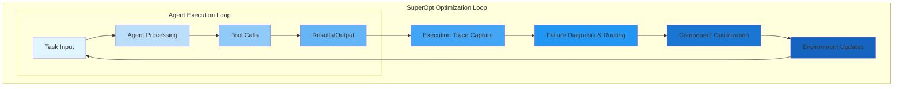
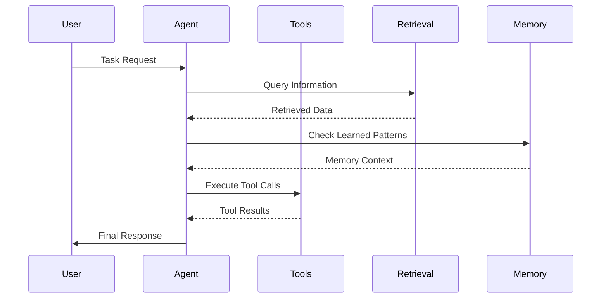
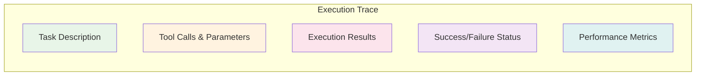
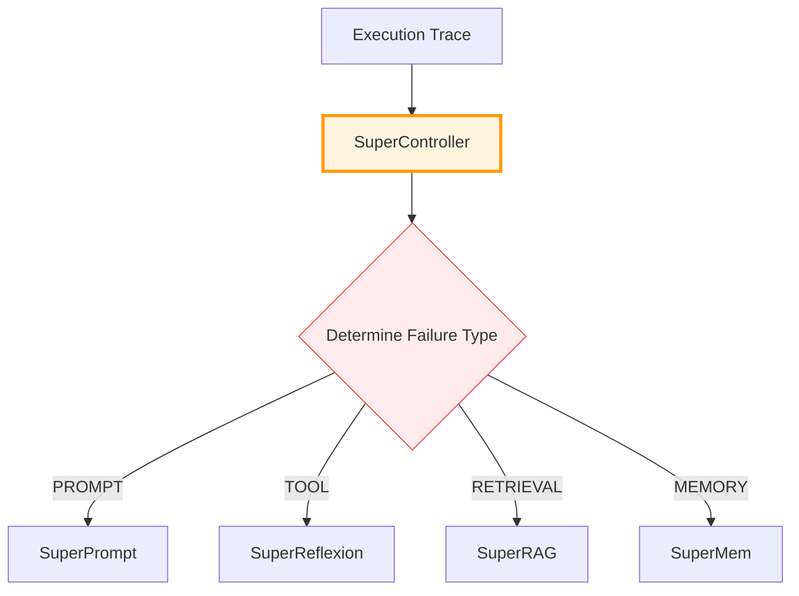
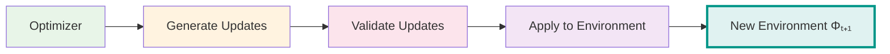
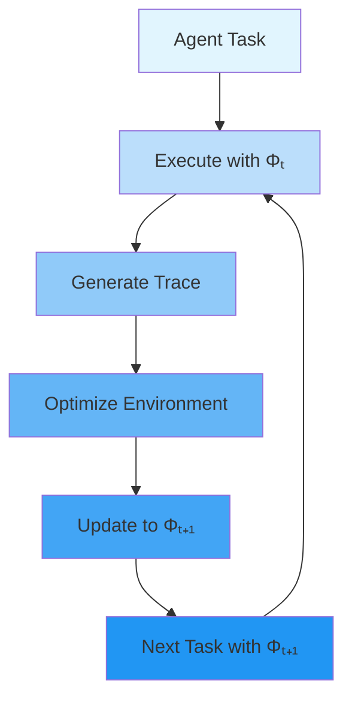

# 🏗️ System Architecture

SuperOpt operates as an optimization layer around autonomous AI agents. This section explains the complete system architecture and how all components work together.

## 📋 Core Design Principles

### SuperOpt Component Architecture

SuperOpt's optimization engine consists of five specialized components that work together to provide comprehensive environment optimization:

<div class="component-architecture-grid">
  <div class="component-arch-card">
    <div class="component-arch-header">
      <div class="component-arch-icon">🎯</div>
      <div class="component-arch-info">
        <h4>SuperController</h4>
        <span class="component-arch-role">Coordinator</span>
      </div>
    </div>
    <p>Analyzes execution traces and routes failures to appropriate optimizers</p>
  </div>

  <div class="component-arch-card">
    <div class="component-arch-header">
      <div class="component-arch-icon">📝</div>
      <div class="component-arch-info">
        <h4>SuperPrompt</h4>
        <span class="component-arch-role">Prompt Optimizer</span>
      </div>
    </div>
    <p>Evolutionary optimization of system prompts and instructions</p>
  </div>

  <div class="component-arch-card">
    <div class="component-arch-header">
      <div class="component-arch-icon">🔧</div>
      <div class="component-arch-info">
        <h4>SuperReflexion</h4>
        <span class="component-arch-role">Tool Repair</span>
      </div>
    </div>
    <p>Self-healing tool schema repair and clarification</p>
  </div>

  <div class="component-arch-card">
    <div class="component-arch-header">
      <div class="component-arch-icon">🔍</div>
      <div class="component-arch-info">
        <h4>SuperRAG</h4>
        <span class="component-arch-role">Retrieval Tuning</span>
      </div>
    </div>
    <p>Adaptive retrieval parameter optimization</p>
  </div>

  <div class="component-arch-card">
    <div class="component-arch-header">
      <div class="component-arch-icon">🧠</div>
      <div class="component-arch-info">
        <h4>SuperMem</h4>
        <span class="component-arch-role">Memory Management</span>
      </div>
    </div>
    <p>Typed memory with decay and conflict resolution</p>
  </div>
</div>

### Outer Optimization Loop
SuperOpt runs as an optimization loop surrounding the agent's normal execution:



### Environment-as-Target
Instead of optimizing model parameters, SuperOpt optimizes the agent's environment:

```
Φ (Agent Environment) = {
  P: Prompts and instructions
  T: Tool schemas and constraints
  R: Retrieval configuration and strategies
  M: Memory entries and learned patterns
}
```

## 🔄 Complete Workflow

### Phase 1: Normal Agent Execution



### Phase 2: Execution Trace Capture



### Phase 3: Failure Diagnosis



### Phase 4: Environment Optimization

<div class="optimizer-grid">
  <div class="optimizer-card">
    <div class="optimizer-icon">📝</div>
    <h4>SuperPrompt</h4>
    <p>PROMPT Failures</p>
    <ul>
      <li>Instruction optimization</li>
      <li>Example generation</li>
      <li>Behavioral constraints</li>
    </ul>
  </div>

  <div class="optimizer-card">
    <div class="optimizer-icon">🔧</div>
    <h4>SuperReflexion</h4>
    <p>TOOL Failures</p>
    <ul>
      <li>Schema clarification</li>
      <li>Constraint addition</li>
      <li>Example provision</li>
    </ul>
  </div>

  <div class="optimizer-card">
    <div class="optimizer-icon">🔍</div>
    <h4>SuperRAG</h4>
    <p>RETRIEVAL Failures</p>
    <ul>
      <li>Parameter tuning</li>
      <li>Query optimization</li>
      <li>Ranking improvement</li>
    </ul>
  </div>

  <div class="optimizer-card">
    <div class="optimizer-icon">🧠</div>
    <h4>SuperMem</h4>
    <p>MEMORY Failures</p>
    <ul>
      <li>Pattern learning</li>
      <li>Conflict resolution</li>
      <li>Confidence tracking</li>
    </ul>
  </div>
</div>

### Phase 5: Environment Update



### Phase 6: Continuous Learning



## 🧩 Component Interactions

### SuperController (Central Coordinator)
```
Input: ExecutionTrace
Process:
├── Analyze success/failure
├── Classify failure type
├── Route to appropriate optimizer
└── Coordinate environment updates
Output: Failure classification + routing decision
```

### SuperPrompt (Prompt Optimization)
```
Input: ExecutionTrace (PROMPT failure)
Process:
├── Extract prompt-related errors
├── Generate improved instructions
├── Add clarifying examples
└── Update behavioral constraints
Output: Updated PromptConfig
```

### SuperReflexion (Tool Schema Repair)
```
Input: ExecutionTrace (TOOL failure)
Process:
├── Identify tool call errors
├── Analyze schema ambiguities
├── Generate clarifications
└── Add constraint documentation
Output: Updated ToolSchema entries
```

### SuperRAG (Retrieval Optimization)
```
Input: ExecutionTrace (RETRIEVAL failure)
Process:
├── Analyze search failures
├── Adjust retrieval parameters
├── Optimize query strategies
└── Tune ranking algorithms
Output: Updated RetrievalConfig
```

### SuperMem (Memory Management)
```
Input: ExecutionTrace (MEMORY failure)
Process:
├── Identify memory conflicts
├── Add new learned patterns
├── Update confidence scores
└── Apply decay to old entries
Output: Updated MemoryEntry list
```

## 🔄 Environment Update Process

### Update Application
```python
# Original environment
environment = AgenticEnvironment(
    prompts=PromptConfig(...),
    tools={"tool1": ToolSchema(...)},
    retrieval=RetrievalConfig(...),
    memory=[MemoryEntry(...)]
)

# Optimizer generates updates
updates = optimizer.generate_updates(trace)

# Apply updates to create new environment
new_environment = environment.apply_updates(updates)
```

### Update Types
- **Prompt Updates**: Add instructions, examples, constraints
- **Tool Updates**: Clarify descriptions, add constraints, provide examples
- **Retrieval Updates**: Adjust parameters, change strategies
- **Memory Updates**: Add new patterns, update confidence scores

## 🛡️ Stability and Safety

### Update Validation
- All updates are validated before application
- Reversible changes prevent permanent damage
- Confidence scoring ensures quality updates

### Gradual Application
- Updates can be applied with different acceptance rates
- Allows for conservative or aggressive optimization
- Enables A/B testing of improvements

### Conflict Resolution
- Memory system handles conflicting information
- Retrieval optimization considers multiple strategies
- Tool updates maintain backward compatibility

## 🔌 Integration Architecture

### Adapter Pattern
SuperOpt connects to agents through adapters:
```
Agent Framework → AgentAdapter → SuperOpt → Environment Updates
```

### Supported Frameworks
- **Aider**: Coding assistant integration
- **Letta**: Memory-enabled agents
- **Codex**: Code understanding agents
- **Custom**: Generic adapter for any agent

This architecture makes SuperOpt framework-agnostic while providing deep integration capabilities.

<style>
.optimizer-grid {
  display: grid;
  grid-template-columns: repeat(auto-fit, minmax(250px, 1fr));
  gap: 1.5rem;
  margin: 2rem 0;
}

.optimizer-card {
  background: var(--md-default-fg-color--lightest);
  border: 1px solid var(--md-default-fg-color--lighter);
  border-radius: 12px;
  padding: 1.5rem;
  text-align: center;
  transition: all 0.3s ease;
}

[data-md-color-scheme="slate"] .optimizer-card {
  background: #1e1e1e;
  border-color: #333;
}

.optimizer-card:hover {
  transform: translateY(-4px);
  box-shadow: 0 8px 25px rgba(0,0,0,0.1);
}

[data-md-color-scheme="slate"] .optimizer-card:hover {
  box-shadow: 0 8px 25px rgba(0,0,0,0.3);
}

.optimizer-icon {
  font-size: 2.5rem;
  margin-bottom: 1rem;
  opacity: 0.8;
}

.optimizer-card h4 {
  font-size: 1.2rem;
  font-weight: 700;
  margin: 0 0 0.5rem 0;
  color: var(--md-primary-fg-color);
}

.optimizer-card p {
  font-size: 0.9rem;
  font-weight: 600;
  color: var(--md-accent-fg-color);
  margin: 0 0 1rem 0;
  text-transform: uppercase;
  letter-spacing: 0.5px;
}

.optimizer-card ul {
  list-style: none;
  padding: 0;
  margin: 0;
  text-align: left;
}

.optimizer-card li {
  font-size: 0.85rem;
  color: var(--md-default-fg-color--light);
  margin-bottom: 0.25rem;
  padding-left: 0.5rem;
  position: relative;
}

.optimizer-card li::before {
  content: "✓";
  color: var(--md-accent-fg-color);
  font-weight: bold;
  position: absolute;
  left: -0.5rem;
}

.component-architecture-grid {
  display: grid;
  grid-template-columns: repeat(auto-fit, minmax(280px, 1fr));
  gap: 1.5rem;
  margin: 2rem 0 3rem 0;
}

.component-arch-card {
  background: var(--md-default-fg-color--lightest);
  border: 1px solid var(--md-default-fg-color--lighter);
  border-radius: 12px;
  padding: 1.5rem;
  transition: all 0.3s ease;
  position: relative;
}

[data-md-color-scheme="slate"] .component-arch-card {
  background: #1e1e1e;
  border-color: #333;
}

.component-arch-card:hover {
  transform: translateY(-4px);
  box-shadow: 0 10px 25px rgba(0,0,0,0.1);
}

[data-md-color-scheme="slate"] .component-arch-card:hover {
  box-shadow: 0 10px 25px rgba(0,0,0,0.5);
}

[data-md-color-scheme="slate"] .component-arch-info h4 {
  color: #ffffff;
}

[data-md-color-scheme="slate"] .component-arch-role {
  color: #90caf9;
}

[data-md-color-scheme="slate"] .component-arch-card p {
  color: #e0e0e0;
}

.component-arch-header {
  display: flex;
  align-items: center;
  gap: 1rem;
  margin-bottom: 1rem;
}

.component-arch-icon {
  font-size: 2rem;
  opacity: 0.8;
}

.component-arch-info h4 {
  font-size: 1.2rem;
  font-weight: 700;
  margin: 0 0 0.25rem 0;
  color: var(--md-primary-fg-color);
}

.component-arch-role {
  font-size: 0.8rem;
  font-weight: 600;
  color: var(--md-accent-fg-color);
  text-transform: uppercase;
  letter-spacing: 0.5px;
}

.component-arch-card p {
  font-size: 0.9rem;
  color: var(--md-default-fg-color--light);
  line-height: 1.5;
  margin: 0;
}

@media (max-width: 768px) {
  .component-architecture-grid {
    grid-template-columns: 1fr;
  }

  .component-arch-header {
    flex-direction: column;
    text-align: center;
    gap: 0.75rem;
  }
}
</style>
