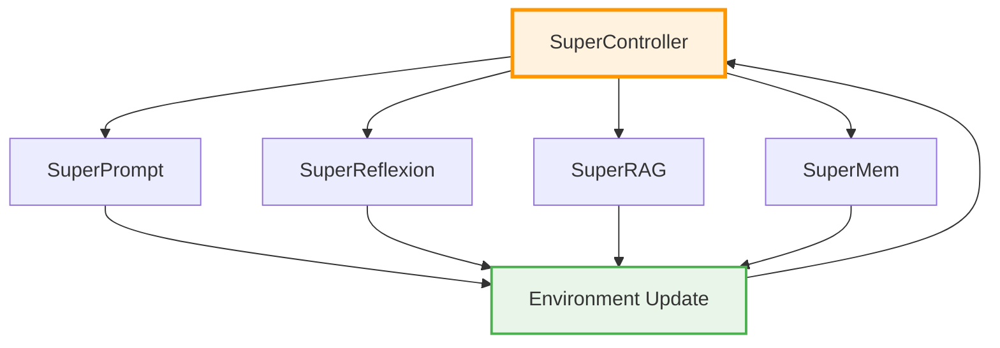
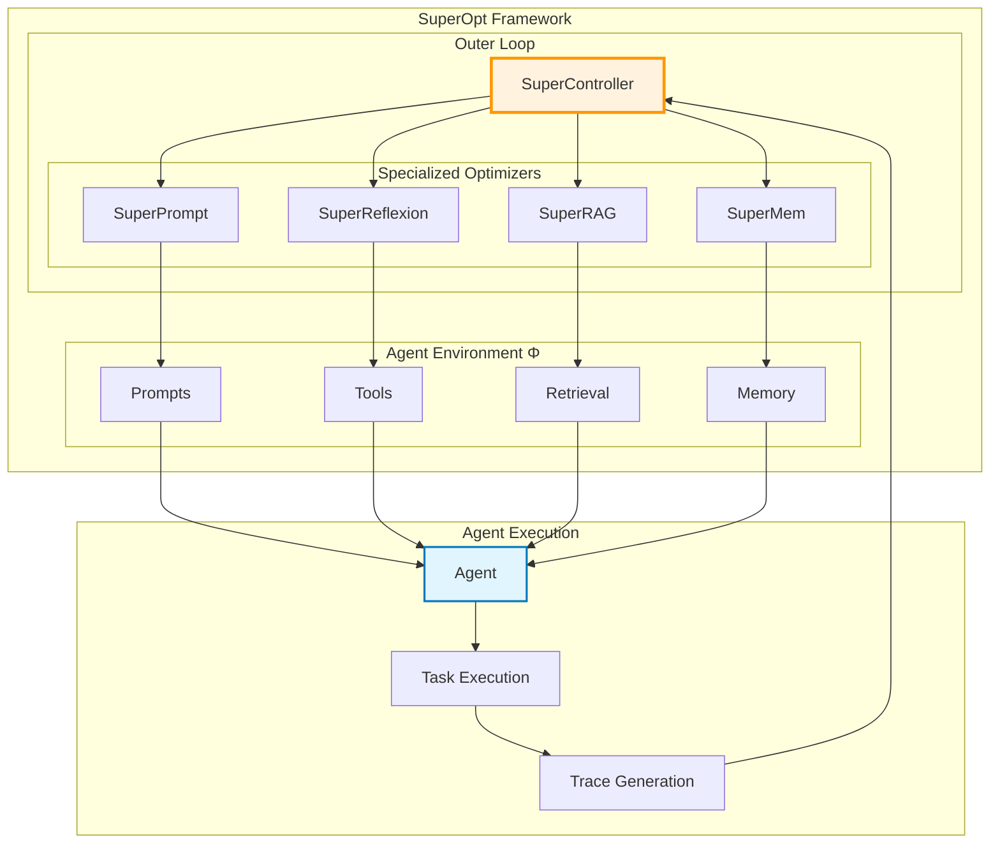

# 🧩 SuperOpt Components

SuperOpt's optimization engine consists of five specialized components that work together to provide comprehensive environment optimization.

## 🎯 Component Overview

Each component targets a specific aspect of the agent environment, working together to create autonomous, self-improving AI agents.

  

    

      
🎯

      <h3>SuperController</h3>
    

    

      
<strong>Role:</strong> Diagnostic meta-controller

      
<strong>Function:</strong> Analyzes execution traces and routes failures to appropriate optimizers

      
<strong>Target:</strong> Failure classification and routing

      

        Rule-based diagnosis
        LLM-enhanced analysis
        Failure statistics
      

    

    <a href="supercontroller/" class="component-overview-link">Learn More →</a>
  

  

    

      
📝

      <h3>SuperPrompt</h3>
    

    

      
<strong>Role:</strong> Evolutionary prompt optimizer

      
<strong>Function:</strong> Improves system prompts using evolutionary algorithms

      
<strong>Target:</strong> Instructions, examples, and behavioral constraints

      

        Evolutionary search
        Pareto optimization
        GEPA-inspired
      

    

    <a href="superprompt/" class="component-overview-link">Learn More →</a>
  

  

    

      
🔧

      <h3>SuperReflexion</h3>
    

    

      
<strong>Role:</strong> Tool schema repair engine

      
<strong>Function:</strong> Fixes tool definitions when agents misuse tools

      
<strong>Target:</strong> Tool schemas, constraints, and documentation

      

        Schema clarification
        Constraint addition
        Example generation
      

    

    <a href="superreflexion/" class="component-overview-link">Learn More →</a>
  

  

    

      
🔍

      <h3>SuperRAG</h3>
    

    

      
<strong>Role:</strong> Retrieval optimization engine

      
<strong>Function:</strong> Tunes retrieval parameters for better information access

      
<strong>Target:</strong> Search algorithms, chunking, and ranking

      

        Parameter tuning
        Query optimization
        Adaptive strategies
      

    

    <a href="superrag/" class="component-overview-link">Learn More →</a>
  

  

    

      
🧠

      <h3>SuperMem</h3>
    

    

      
<strong>Role:</strong> Memory management system

      
<strong>Function:</strong> Manages learned patterns with decay and conflict resolution

      
<strong>Target:</strong> Knowledge persistence, freshness, and consistency

      

        Exponential decay
        Conflict resolution
        Confidence tracking
      

    

    <a href="supermem/" class="component-overview-link">Learn More →</a>
  

## 🔄 Component Interactions

## 🎯 Component Responsibilities

| Component | Failure Type | Environment Target | Optimization Method |
|-----------|-------------|-------------------|-------------------|
| **SuperController** | All Types | - | Diagnosis & Routing |
| **SuperPrompt** | PROMPT | Prompts & Instructions | Evolutionary Search |
| **SuperReflexion** | TOOL | Tool Schemas | Schema Repair |
| **SuperRAG** | RETRIEVAL | Search & Ranking | Parameter Tuning |
| **SuperMem** | MEMORY | Knowledge Base | Decay & Resolution |

## 🏗️ System Architecture

## 📊 Component Workflow

1. **Failure Detection**: SuperController analyzes execution traces
2. **Routing Decision**: Routes failure to appropriate optimizer
3. **Optimization**: Specialized component improves its environment aspect
4. **Environment Update**: Changes are applied to agent environment
5. **Continuous Learning**: Agent becomes better over time

