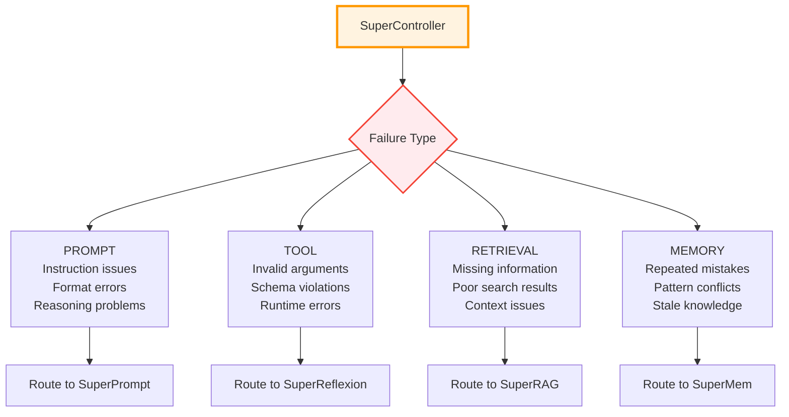

# 🎯 SuperController

The SuperController is the diagnostic brain of SuperOpt. It analyzes execution traces to determine what went wrong and routes failures to the appropriate optimization engine.

## 🎯 Core Function

The SuperController classifies failures into four main categories:



## 🔍 Failure Classification

### PROMPT Failures
- Agent ignores or misinterprets instructions
- Output doesn't match required format
- Reasoning contains hallucinations or logical errors
- Examples are insufficient or misleading

### TOOL Failures
- Function calls use invalid arguments
- Tool schemas are ambiguous or incomplete
- Runtime exceptions during tool execution
- Required parameters are missing or incorrect

### RETRIEVAL Failures
- Agent can't find relevant information
- Search results are empty or irrelevant
- Context windows are too small or overflow
- File references are hallucinated or incorrect

### MEMORY Failures
- Agent repeats mistakes it has made before
- Learned patterns conflict with current task
- Knowledge has become outdated or incorrect
- Agent forgets important context

## 🔧 Diagnosis Methods

### Rule-Based Diagnosis (Default)
The SuperController uses a priority-based rule system:

```python
def _rule_based_diagnose(self, trace: ExecutionTrace) -> FailureType:
    # 1. Check for tool errors (most specific)
    if trace.has_tool_error() or trace.invalid_arguments():
        return FailureType.TOOL

    # 2. Check for retrieval failures
    if trace.missing_symbol() or trace.retrieval_empty():
        return FailureType.RETRIEVAL

    # 3. Check for prompt violations
    if trace.violates_instruction() or trace.output_format_error():
        return FailureType.PROMPT

    # 4. Check for memory issues (most general)
    if trace.repeats_known_mistake() or trace.conflicts_with_memory():
        return FailureType.MEMORY

    # Default fallback
    return FailureType.MEMORY
```

### LLM-Based Diagnosis (Advanced)
When enabled, uses an LLM to analyze traces:

```python
def _llm_diagnose(self, trace: ExecutionTrace) -> FailureType:
    # Build analysis prompt
    prompt = self._build_diagnosis_prompt(trace, environment)

    # Get LLM analysis
    response = self.llm_client.generate(prompt)

    # Parse and return failure classification
    return FailureType(self._parse_llm_response(response))
```

## 📊 Failure Statistics

The SuperController tracks failure patterns:

```python
self.failure_statistics = {
    "PROMPT": 0,
    "TOOL": 0,
    "RETRIEVAL": 0,
    "MEMORY": 0,
    "NONE": 0,  # Successful executions
}
```

This helps identify which parts of the environment need the most optimization.

## 🔄 Integration with Optimization Flow

### Diagnosis Phase
1. **Input**: ExecutionTrace from agent execution
2. **Analysis**: Classify dominant failure mode
3. **Output**: FailureType enum (PROMPT, TOOL, RETRIEVAL, MEMORY)

### Routing Phase
Based on diagnosis, routes to appropriate optimizer:

```python
failure_type = supercontroller.diagnose(trace)

match failure_type:
    case FailureType.PROMPT:
        optimizer = SuperPrompt()
    case FailureType.TOOL:
        optimizer = SuperReflexion()
    case FailureType.RETRIEVAL:
        optimizer = SuperRAG()
    case FailureType.MEMORY:
        optimizer = SuperMem()
```

## ⚙️ Configuration Options

### Basic Configuration
```python
supercontroller = SuperController(
    use_llm_diagnosis=False,  # Use rule-based diagnosis
    llm_client=None
)
```

### Advanced Configuration
```python
supercontroller = SuperController(
    use_llm_diagnosis=True,   # Use LLM for diagnosis
    llm_client=my_llm_client  # Provide LLM client
)
```

## 🔍 Diagnostic Capabilities

### Trace Analysis
- **Success Detection**: Identifies successful vs failed executions
- **Error Categorization**: Classifies specific types of failures
- **Pattern Recognition**: Learns from repeated failure patterns
- **Context Awareness**: Considers environment state in diagnosis

### Quality Assurance
- **Fallback Logic**: Rule-based backup when LLM fails
- **Confidence Scoring**: Rates certainty of diagnosis
- **Statistics Tracking**: Monitors failure distribution over time

## 🎯 Use Cases

### Development Phase
- **Debugging**: Quickly identify why agents fail
- **Pattern Discovery**: Find common failure modes
- **Optimization Planning**: Decide which components to improve

### Production Phase
- **Monitoring**: Track agent performance over time
- **Automated Fixes**: Route failures to appropriate optimizers
- **Quality Assurance**: Ensure consistent agent behavior

The SuperController is the intelligent coordinator that makes SuperOpt's multi-component optimization possible by accurately diagnosing and routing every failure to the right solution.
