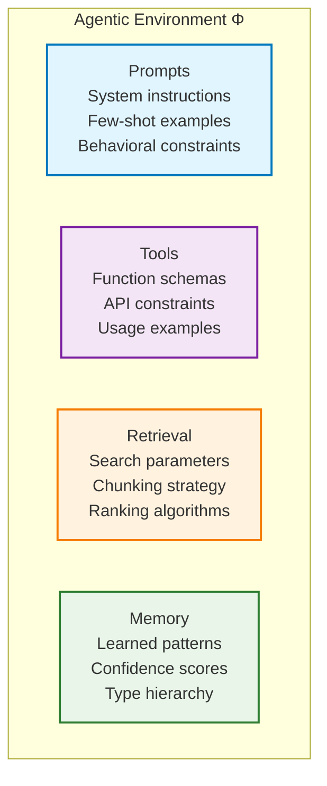

# 🔍 What Problems Does SuperOpt Solve?

SuperOpt addresses fundamental challenges in building reliable autonomous AI agents. Instead of retraining entire models, SuperOpt optimizes the environment around agents to make them more effective.

## 🤔 The Core Problem

AI agents often fail at tasks because of issues in their environment, not because the underlying model is incapable. When an agent fails, the typical approach is to:

- Retrain the entire model (expensive and slow)
- Manually adjust prompts (trial and error)
- Accept the failure as inevitable

SuperOpt takes a different approach: **optimize the environment** where the agent operates.

## 🎯 Environment Optimization

SuperOpt treats the complete agent environment as an optimization target:



<div class="environment-explanation">
  <div class="env-component">
    <div class="env-icon">📝</div>
    <h4>Prompts</h4>
    <p>System instructions, task descriptions, behavioral guidelines, and example interactions that guide agent behavior.</p>
  </div>

  <div class="env-component">
    <div class="env-icon">🔧</div>
    <h4>Tools</h4>
    <p>Function schemas, parameter definitions, usage constraints, and error handling specifications for agent capabilities.</p>
  </div>

  <div class="env-component">
    <div class="env-icon">🔍</div>
    <h4>Retrieval</h4>
    <p>Search algorithms, information chunking, relevance ranking, and context window management for knowledge access.</p>
  </div>

  <div class="env-component">
    <div class="env-icon">🧠</div>
    <h4>Memory</h4>
    <p>Learned patterns, experience accumulation, confidence tracking, and conflict resolution for continuous improvement.</p>
  </div>
</div>

When agents fail, SuperOpt identifies which part of the environment needs improvement and makes targeted updates.

## 📊 Common Failure Patterns

### Prompt Failures
- Instructions are unclear or incomplete
- Examples don't cover edge cases
- Output format requirements are missing

### Tool Failures
- Function descriptions are ambiguous
- Required parameters aren't specified
- Error handling isn't documented

### Retrieval Failures
- Search queries don't find relevant information
- Results are ranked poorly
- Context windows are too small or too large

### Memory Failures
- Previously learned patterns are forgotten
- Conflicting information causes confusion
- Outdated knowledge persists

## ⚡ The SuperOpt Solution

SuperOpt runs as an outer optimization loop around normal agent execution:

```
┌─────────────────────────────────────────────────────────────┐
│                    SuperOpt Optimization Loop                │
│  ┌─────────────────────────────────────────────────────────┐│
│  │                  Agent Execution Loop                    ││
│  │   Task → Agent → Tool Calls → Results → Output          ││
│  └─────────────────────────────────────────────────────────┘│
│                           │                                  │
│                    Execution Trace                           │
│                           ↓                                  │
│  ┌─────────────────────────────────────────────────────────┐│
│  │              SuperController (Diagnosis)                 ││
│  │   Classify failure: PROMPT | TOOL | RETRIEVAL | MEMORY  ││
│  └─────────────────────────────────────────────────────────┘│
│                           │                                  │
│         ┌─────────────────┼─────────────────┐               │
│         ↓                 ↓                 ↓               │
│   ┌──────────┐     ┌──────────┐     ┌──────────┐           │
│   │SuperPrompt│     │SuperReflexion│  │ SuperRAG │           │
│   │(Prompts) │     │  (Tools)  │     │(Retrieval)│           │
│   └──────────┘     └──────────┘     └──────────┘           │
│         │                 │                 │               │
│         └─────────────────┼─────────────────┘               │
│                           ↓                                  │
│              Environment Updates                            │
└─────────────────────────────────────────────────────────────┘
```

## 🎁 Key Benefits

### No Model Retraining
- Improvements happen at the environment level
- Changes are immediate and reversible
- Works with any underlying model

### Automatic Diagnosis
- SuperController analyzes execution traces
- Identifies root causes automatically
- Routes failures to appropriate fixes

### Comprehensive Coverage
- Handles all types of environment failures
- Maintains stability across updates
- Learns from every interaction

### Framework Agnostic
- Works with any agent architecture
- Integrates through adapter pattern
- No changes needed to existing agents

## 🚀 Real-World Impact

Instead of agents failing repeatedly at the same tasks, SuperOpt enables continuous improvement:

<div class="comparison-section">
  <div class="comparison-item">
    <h4>❌ Traditional Approach</h4>
    <div class="workflow-diagram">
      <div class="step">Agent Fails</div>
      <div class="arrow">→</div>
      <div class="step">Manual Debugging</div>
      <div class="arrow">→</div>
      <div class="step">Trial & Error</div>
      <div class="arrow">→</div>
      <div class="step">Limited Improvement</div>
    </div>
  </div>

  <div class="comparison-item">
    <h4>✅ SuperOpt Approach</h4>
    <div class="workflow-diagram">
      <div class="step success">Agent Fails</div>
      <div class="arrow">→</div>
      <div class="step success">Auto Analysis</div>
      <div class="arrow">→</div>
      <div class="step success">Targeted Fixes</div>
      <div class="arrow">→</div>
      <div class="step success">Continuous Learning</div>
    </div>
  </div>
</div>

This makes autonomous agents more reliable and capable over time.

<style>
.environment-explanation {
  display: grid;
  grid-template-columns: repeat(auto-fit, minmax(250px, 1fr));
  gap: 1.5rem;
  margin: 2rem 0;
}

.env-component {
  background: var(--md-default-fg-color--lightest);
  border: 1px solid var(--md-default-fg-color--lighter);
  border-radius: 12px;
  padding: 1.5rem;
  text-align: center;
  transition: all 0.3s ease;
}

[data-md-color-scheme="slate"] .env-component {
  background: #1e1e1e;
  border-color: #333;
}

.env-component:hover {
  transform: translateY(-4px);
  box-shadow: 0 8px 25px rgba(0,0,0,0.1);
}

[data-md-color-scheme="slate"] .env-component:hover {
  box-shadow: 0 8px 25px rgba(0,0,0,0.3);
}

.env-icon {
  font-size: 2.5rem;
  margin-bottom: 1rem;
  opacity: 0.8;
}

.env-component h4 {
  font-size: 1.2rem;
  font-weight: 700;
  margin: 0 0 0.75rem 0;
  color: var(--md-primary-fg-color);
}

.env-component p {
  font-size: 0.9rem;
  color: var(--md-default-fg-color--light);
  line-height: 1.5;
  margin: 0;
}

.comparison-section {
  display: grid;
  grid-template-columns: repeat(auto-fit, minmax(300px, 1fr));
  gap: 2rem;
  margin: 2rem 0;
}

.comparison-item {
  background: var(--md-default-fg-color--lightest);
  border: 1px solid var(--md-default-fg-color--lighter);
  border-radius: 12px;
  padding: 1.5rem;
  text-align: center;
}

[data-md-color-scheme="slate"] .comparison-item {
  background: #1e1e1e;
  border-color: #333;
}

.comparison-item h4 {
  font-size: 1.1rem;
  font-weight: 700;
  margin: 0 0 1rem 0;
  color: var(--md-primary-fg-color);
}

.workflow-diagram {
  display: flex;
  align-items: center;
  justify-content: center;
  flex-wrap: wrap;
  gap: 0.5rem;
}

.step {
  background: var(--md-default-fg-color--lightest);
  border: 1px solid var(--md-default-fg-color--lighter);
  border-radius: 8px;
  padding: 0.75rem 1rem;
  font-size: 0.85rem;
  font-weight: 600;
  color: var(--md-default-fg-color);
  white-space: nowrap;
}

[data-md-color-scheme="slate"] .step {
  background: #2a2a2a;
  border-color: #444;
  color: var(--md-default-fg-color);
}

.step.success {
  background: linear-gradient(135deg, #4caf50, #66bb6a);
  color: white;
  border-color: #4caf50;
}

.arrow {
  font-size: 1.2rem;
  color: var(--md-primary-fg-color);
  font-weight: bold;
}
</style>
