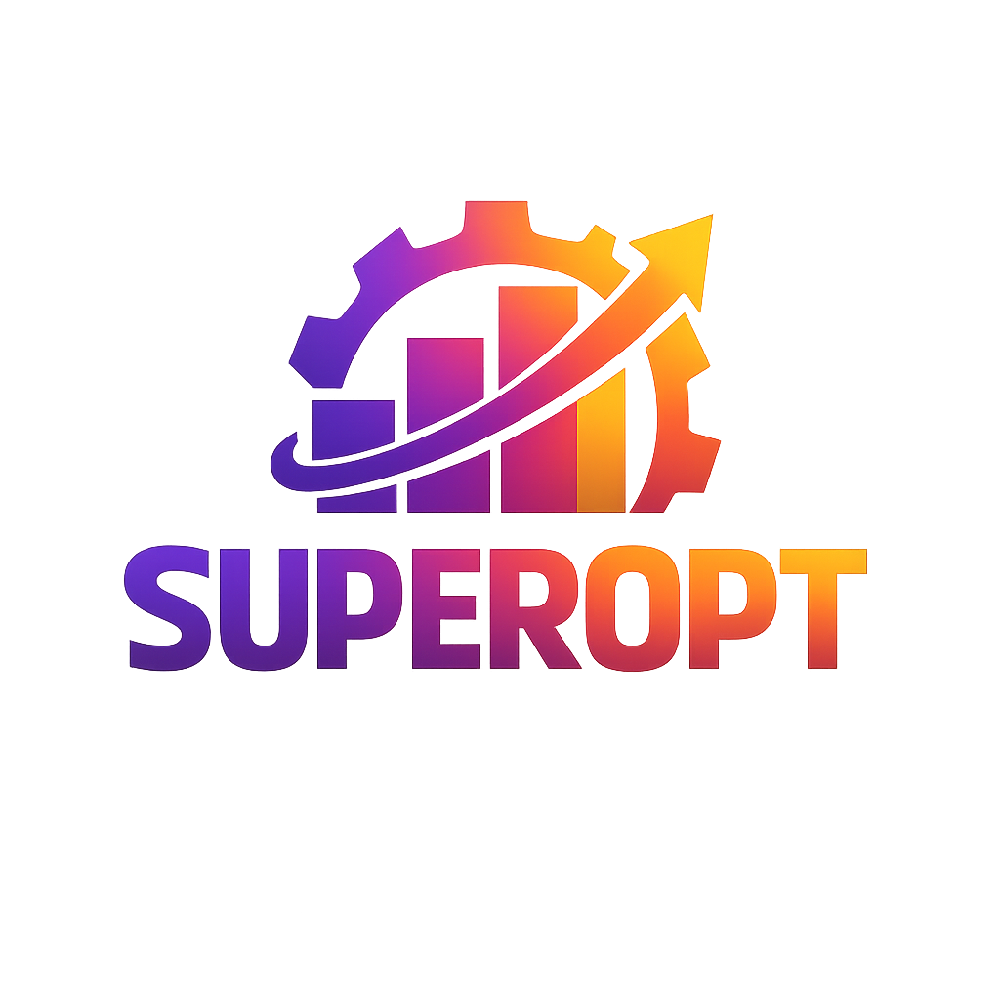

# SuperOpt

<div class="beta-notice">
  <span class="beta-badge">BETA</span>
  <span class="beta-text">This documentation is actively evolving. Features and APIs may change.</span>
</div>

<div class="hero-section">
  <div class="hero-content">
    <div class="hero-left">
      
    </div>
    <div class="hero-right">
      <p class="hero-subtitle">
        Agentic Environment Optimization for Autonomous AI Agents
      </p>
      <p class="hero-built-by">
        Built by <a href="https://super-agentic.ai/" target="_blank" rel="noopener">Superagentic AI</a>
      </p>
    </div>
  </div>
  <div class="hero-center-cta">
    <div class="hero-actions">
      <a href="getting-started/installation/" class="cta-button primary">Get Started</a>
    </div>
  </div>
</div>

## 🌟 What is Agent Environment Optimization?

<div class="why-superopt">
  <div class="problem-solution">
    <div class="problem">
      <h3>❌ Traditional AI Optimization</h3>
      <ul>
        <li>Model retraining is expensive and slow</li>
        <li>Limited by fixed training datasets</li>
        <li>Prompt optimization alone is insufficient</li>
        <li>No coordination between prompts, tools, and memory</li>
        <li>Agents can't learn from their own failures</li>
      </ul>
    </div>
    <div class="solution">
      <h3>✅ Agent Environment Optimization</h3>
      <ul>
        <li>Optimize the entire agent environment as a unified system</li>
        <li>Treat prompts, tools, retrieval, and memory as optimization targets</li>
        <li>Automatic failure diagnosis and routing to appropriate optimizers</li>
        <li>Continuous learning from execution traces</li>
        <li>Stability guarantees prevent oscillation and ensure convergence</li>
      </ul>
    </div>
  </div>
</div>

## 🏗️ Core Architecture

<div class="architecture-overview">
  <div class="architecture-diagram">
    <div class="component supercontroller">
      <div class="component-icon">🎯</div>
      <h4>SuperController</h4>
      <p>Intelligent orchestrator that analyzes failures and routes optimization tasks</p>
    </div>
    <div class="component superprompt">
      <div class="component-icon">📝</div>
      <h4>SuperPrompt</h4>
      <p>Evolutionary prompt optimization using reflective mutation techniques</p>
    </div>
    <div class="component superreflexion">
      <div class="component-icon">🔧</div>
      <h4>SuperReflexion</h4>
      <p>Tool schema repair and constraint generation for robust execution</p>
    </div>
    <div class="component superrag">
      <div class="component-icon">🔍</div>
      <h4>SuperRAG</h4>
      <p>Retrieval system optimization and parameter tuning</p>
    </div>
    <div class="component supermem">
      <div class="component-icon">🧠</div>
      <h4>SuperMem</h4>
      <p>Advanced memory management with conflict resolution</p>
    </div>
  </div>
</div>

## ⚡ Quick Start

SuperOpt automatically learns from your agent's failures and successes, continuously improving prompts, tools, and memory. This same approach scales from simple demos to complex production agents.

> **Try It Now:** Copy and run the complete example below to see SuperOpt in action!

```bash
pip install superopt
```

```python
# Complete working example - copy this entire code block
from superopt import SuperOpt, AgenticEnvironment
from superopt.core.environment import PromptConfig, ToolSchema
from superopt.core.trace import ExecutionTrace, ToolCall

# Define your agent's environment
environment = AgenticEnvironment(
    prompts=PromptConfig(system_prompt="You are a helpful coding assistant."),
    tools={
        "edit_file": ToolSchema(
            name="edit_file",
            description="Edit a file at a specific line",
            arguments={"file": "str", "line": "int"},
        ),
    },
)

# Create the learning optimizer
optimizer = SuperOpt(environment)

# Simulate a failure (your agent tried to edit line 0)
trace = ExecutionTrace(
    task_description="Edit line 0 in test.py",
    success=False,
)
trace.tool_errors.append(ToolCall(
    tool_name="edit_file",
    arguments={"file": "test.py", "line": 0},
    error_message="Line numbers must be 1-indexed",
))

print("Before SuperOpt:")
print(optimizer.environment.tools['edit_file'].description)
print()

# SuperOpt learns and fixes the problem automatically!
optimizer.step(trace)

print("After SuperOpt learned from the failure:")
print(optimizer.environment.tools['edit_file'].description)
```

**Save this as `test_superopt.py` and run `python test_superopt.py`** to see SuperOpt automatically fix the tool schema!

> **Real-World Applications:** This same approach scales to production agents handling customer support, code generation, data analysis, API integrations, and complex workflows. Every user interaction becomes a learning opportunity!

## 🎯 Key Benefits of Agent Environment Optimization

<div class="benefits-grid">
  <div class="benefit-card">
    <div class="benefit-icon">🏗️</div>
    <h4>Unified Environment Optimization</h4>
    <p>Optimize prompts, tools, retrieval, and memory as a coordinated system, not isolated components.</p>
  </div>

  <div class="benefit-card">
    <div class="benefit-icon">🎯</div>
    <h4>Intelligent Failure Diagnosis</h4>
    <p>Automatically classify failures and route them to the appropriate optimizer for precise fixes.</p>
  </div>

  <div class="benefit-card">
    <div class="benefit-icon">🔄</div>
    <h4>Continuous Self-Improvement</h4>
    <p>Agents learn and adapt from every interaction using execution traces as supervision signals.</p>
  </div>

  <div class="benefit-card">
    <div class="benefit-icon">⚡</div>
    <h4>No Model Retraining Required</h4>
    <p>All improvements happen at the environment level, enabling fast iteration without expensive training.</p>
  </div>

  <div class="benefit-card">
    <div class="benefit-icon">🛡️</div>
    <h4>Stability Guarantees</h4>
    <p>Hierarchy of mutability prevents destructive updates and ensures reliable convergence.</p>
  </div>

  <div class="benefit-card">
    <div class="benefit-icon">🔌</div>
    <h4>Framework Agnostic</h4>
    <p>Works with any AI agent framework through modular adapters and standardized interfaces.</p>
  </div>
</div>

## 📚 Learn More

<div class="learn-more-section">
  <div class="doc-links">
    <a href="getting-started/installation/" class="doc-link">
      <div class="doc-icon">📦</div>
      <div class="doc-content">
        <h4>Installation Guide</h4>
        <p>Get SuperOpt up and running in minutes</p>
      </div>
    </a>

    <a href="getting-started/quickstart/" class="doc-link">
      <div class="doc-icon">⚡</div>
      <div class="doc-content">
        <h4>Quick Start</h4>
        <p>Build your first optimized agent</p>
      </div>
    </a>

    <a href="concepts/overview/" class="doc-link">
      <div class="doc-icon">💡</div>
      <div class="doc-content">
        <h4>Concepts</h4>
        <p>Understand the optimization framework</p>
      </div>
    </a>

    <a href="components/overview/" class="doc-link">
      <div class="doc-icon">🧩</div>
      <div class="doc-content">
        <h4>Components</h4>
        <p>Explore all SuperOpt modules</p>
      </div>
    </a>

    <a href="api/core/" class="doc-link">
      <div class="doc-icon">📚</div>
      <div class="doc-content">
        <h4>API Reference</h4>
        <p>Complete developer documentation</p>
      </div>
    </a>

    <a href="examples/overview/" class="doc-link">
      <div class="doc-icon">🔌</div>
      <div class="doc-content">
        <h4>Examples</h4>
        <p>Real-world integration patterns</p>
      </div>
    </a>
  </div>
</div>

<style>
/* ===== HERO BANNER ===== */
.hero-banner {
  background: linear-gradient(135deg,
    rgba(0, 121, 107, 0.08) 0%,
    rgba(0, 150, 136, 0.05) 50%,
    rgba(77, 182, 172, 0.03) 100%);
  border-radius: 16px;
  padding: 3rem 2rem;
  margin: 2rem 0 4rem 0;
  border: 1px solid rgba(0, 121, 107, 0.1);
}

[data-md-color-scheme="slate"] .hero-banner {
  background: linear-gradient(135deg,
    rgba(77, 182, 172, 0.08) 0%,
    rgba(128, 203, 196, 0.05) 50%,
    rgba(0, 121, 107, 0.03) 100%);
  border-color: rgba(77, 182, 172, 0.2);
}

.hero-content {
  display: grid;
  grid-template-columns: 1fr 1fr;
  gap: 3rem;
  align-items: center;
  max-width: 1200px;
  margin: 0 auto;
}

.hero-text {
  padding-right: 2rem;
}

.hero-title {
  font-size: clamp(2.5rem, 4vw, 3.5rem);
  font-weight: 800;
  margin: 0 0 1rem 0;
  background: linear-gradient(135deg, #00796b, #4db6ac);
  -webkit-background-clip: text;
  -webkit-text-fill-color: transparent;
  background-clip: text;
  line-height: 1.1;
}

.hero-subtitle {
  font-size: clamp(1.2rem, 2vw, 1.8rem);
  font-weight: 600;
  margin: 0 0 1.5rem 0;
  color: var(--md-primary-fg-color);
}

.hero-description {
  font-size: 1.1rem;
  line-height: 1.6;
  color: var(--md-default-fg-color--light);
  margin: 0;
}

/* ===== OPTIMIZATION FLOW VISUAL ===== */
.optimization-flow {
  display: flex;
  align-items: center;
  justify-content: center;
  gap: 1rem;
  padding: 2rem;
  background: rgba(255, 255, 255, 0.8);
  border-radius: 12px;
  border: 2px solid rgba(0, 121, 107, 0.2);
}

[data-md-color-scheme="slate"] .optimization-flow {
  background: rgba(0, 0, 0, 0.5);
  border-color: rgba(77, 182, 172, 0.3);
}

.flow-step {
  display: flex;
  flex-direction: column;
  align-items: center;
  text-align: center;
  min-width: 80px;
}

.step-icon {
  font-size: 2rem;
  margin-bottom: 0.5rem;
}

.step-label {
  font-size: 0.9rem;
  font-weight: 600;
  color: var(--md-primary-fg-color);
}

.flow-arrow {
  font-size: 1.5rem;
  color: var(--md-primary-fg-color);
  opacity: 0.6;
}

/* ===== WHY SUPEROPT ===== */
.why-superopt {
  margin: 3rem 0;
}

.problem-solution {
  display: grid;
  grid-template-columns: 1fr 1fr;
  gap: 2rem;
}

.problem, .solution {
  background: var(--md-default-fg-color--lightest);
  border: 1px solid var(--md-default-fg-color--lighter);
  border-radius: 12px;
  padding: 2rem;
}

[data-md-color-scheme="slate"] .problem,
[data-md-color-scheme="slate"] .solution {
  background: #1a1a1a;
  border-color: #404040;
}

.problem h3 {
  color: #d32f2f;
  margin: 0 0 1rem 0;
}

.solution h3 {
  color: #2e7d32;
  margin: 0 0 1rem 0;
}

.problem ul, .solution ul {
  margin: 0;
  padding-left: 1.5rem;
}

.problem li, .solution li {
  margin: 0.5rem 0;
  color: var(--md-default-fg-color--light);
}

/* ===== ARCHITECTURE OVERVIEW ===== */
.architecture-overview {
  margin: 4rem 0;
}

.architecture-diagram {
  display: grid;
  grid-template-columns: repeat(auto-fit, minmax(200px, 1fr));
  gap: 2rem;
  margin-top: 2rem;
}

.component {
  background: var(--md-default-fg-color--lightest);
  border: 1px solid var(--md-default-fg-color--lighter);
  border-radius: 12px;
  padding: 2rem;
  text-align: center;
  transition: all 0.3s ease;
}

[data-md-color-scheme="slate"] .component {
  background: #1a1a1a;
  border-color: #404040;
}

.component:hover {
  transform: translateY(-4px);
  box-shadow: 0 10px 25px rgba(0, 0, 0, 0.1);
}

[data-md-color-scheme="slate"] .component:hover {
  box-shadow: 0 10px 25px rgba(0, 0, 0, 0.3);
}

.component-icon {
  font-size: 3rem;
  margin-bottom: 1rem;
  opacity: 0.9;
}

.component h4 {
  font-size: 1.1rem;
  font-weight: 600;
  margin: 0 0 0.8rem 0;
  color: var(--md-primary-fg-color);
}

.component p {
  color: var(--md-default-fg-color--light);
  line-height: 1.5;
  margin: 0;
  font-size: 0.85rem;
}

/* ===== QUICK START ===== */
.quick-start-section {
  display: grid;
  grid-template-columns: 1fr 1fr;
  gap: 2rem;
  margin: 4rem 0;
}

.installation-box, .usage-box {
  background: var(--md-default-fg-color--lightest);
  border: 1px solid var(--md-default-fg-color--lighter);
  border-radius: 12px;
  padding: 2rem;
}

[data-md-color-scheme="slate"] .installation-box,
[data-md-color-scheme="slate"] .usage-box {
  background: #1a1a1a;
  border-color: #404040;
}

.installation-box h3, .usage-box h3 {
  margin: 0 0 1.5rem 0;
  color: var(--md-primary-fg-color);
  font-size: 1.4rem;
}

.code-block {
  background: var(--md-code-bg-color);
  border: 1px solid var(--md-default-fg-color--lighter);
  border-radius: 8px;
  padding: 1rem;
  font-family: 'SF Mono', 'Monaco', 'Inconsolata', monospace;
  font-size: 0.9rem;
  line-height: 1.5;
  overflow-x: auto;
}

[data-md-color-scheme="slate"] .code-block {
  background: #1a1a1a;
  border-color: #404040;
  color: #e0e0e0;
}

/* ===== BENEFITS GRID ===== */
.benefits-grid {
  display: grid;
  grid-template-columns: repeat(auto-fit, minmax(300px, 1fr));
  gap: 2rem;
  margin: 4rem 0;
}

.benefit-card {
  background: var(--md-default-fg-color--lightest);
  border: 1px solid var(--md-default-fg-color--lighter);
  border-radius: 12px;
  padding: 2rem;
  text-align: center;
  transition: all 0.3s ease;
}

[data-md-color-scheme="slate"] .benefit-card {
  background: #1a1a1a;
  border-color: #404040;
}

.benefit-card:hover {
  transform: translateY(-4px);
  box-shadow: 0 10px 25px rgba(0, 0, 0, 0.1);
}

[data-md-color-scheme="slate"] .benefit-card:hover {
  box-shadow: 0 10px 25px rgba(0, 0, 0, 0.3);
}

.benefit-icon {
  font-size: 3rem;
  margin-bottom: 1rem;
  opacity: 0.9;
}

.benefit-card h4 {
  font-size: 1.3rem;
  font-weight: 600;
  margin: 0 0 1rem 0;
  color: var(--md-primary-fg-color);
}

.benefit-card p {
  color: var(--md-default-fg-color--light);
  line-height: 1.6;
  margin: 0;
  font-size: 0.95rem;
}

/* ===== LEARN MORE ===== */
.learn-more-section {
  margin: 4rem 0;
}

.doc-links {
  display: grid;
  grid-template-columns: repeat(auto-fit, minmax(300px, 1fr));
  gap: 1.5rem;
}

.doc-link {
  display: flex;
  align-items: center;
  background: var(--md-default-fg-color--lightest);
  border: 1px solid var(--md-default-fg-color--lighter);
  border-radius: 12px;
  padding: 1.5rem;
  text-decoration: none;
  transition: all 0.3s ease;
  color: inherit;
}

[data-md-color-scheme="slate"] .doc-link {
  background: #1a1a1a;
  border-color: #404040;
}

.doc-link:hover {
  transform: translateY(-2px);
  box-shadow: 0 8px 20px rgba(0, 0, 0, 0.1);
  border-color: var(--md-primary-fg-color);
}

[data-md-color-scheme="slate"] .doc-link:hover {
  box-shadow: 0 8px 20px rgba(0, 0, 0, 0.3);
}

.doc-icon {
  font-size: 2rem;
  margin-right: 1rem;
  flex-shrink: 0;
}

.doc-content h4 {
  margin: 0 0 0.5rem 0;
  font-size: 1.2rem;
  font-weight: 600;
  color: var(--md-primary-fg-color);
}

.doc-content p {
  margin: 0;
  color: var(--md-default-fg-color--light);
  font-size: 0.95rem;
}

/* ===== RESPONSIVE DESIGN ===== */
@media (max-width: 1024px) {
  .hero-content {
    grid-template-columns: 1fr;
    gap: 2rem;
  }

  .hero-text {
    padding-right: 0;
    text-align: center;
  }

  .optimization-flow {
    flex-wrap: wrap;
    gap: 0.5rem;
  }

  .flow-step {
    min-width: 60px;
  }

  .flow-arrow {
    transform: rotate(90deg);
  }
}

@media (max-width: 768px) {
  .hero-banner {
    padding: 2rem 1rem;
  }

  .hero-title {
    font-size: 2.5rem;
  }

  .hero-subtitle {
    font-size: 1.4rem;
  }

  .problem-solution {
    grid-template-columns: 1fr;
    gap: 1.5rem;
  }

  .architecture-diagram {
    grid-template-columns: 1fr;
  }

  .quick-start-section {
    grid-template-columns: 1fr;
    gap: 1.5rem;
  }

  .benefits-grid {
    grid-template-columns: 1fr;
  }

  .doc-links {
    grid-template-columns: 1fr;
  }

  .optimization-flow {
    padding: 1rem;
  }

  .flow-step {
    min-width: 50px;
  }

  .step-icon {
    font-size: 1.5rem;
  }

  .step-label {
    font-size: 0.8rem;
  }
}

@media (max-width: 480px) {
  .hero-banner {
    padding: 1.5rem 1rem;
  }

  .hero-title {
    font-size: 2rem;
  }

  .hero-subtitle {
    font-size: 1.2rem;
  }

  .hero-description {
    font-size: 1rem;
  }

  .component, .benefit-card, .installation-box, .usage-box {
    padding: 1.5rem;
  }

  .doc-link {
    padding: 1rem;
  }

  .doc-icon {
    font-size: 1.8rem;
    margin-right: 0.8rem;
  }
}
</style>
